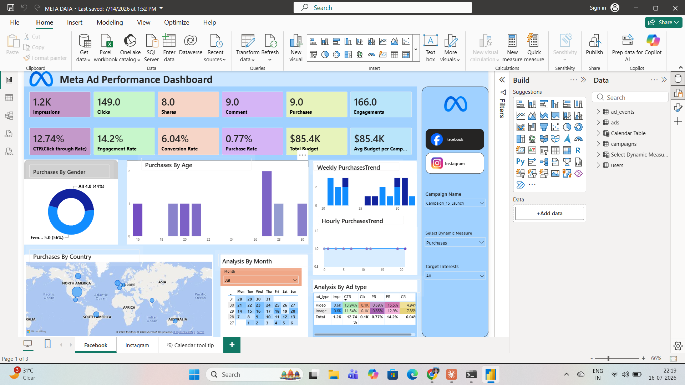

# Meta Ad Performance Dashboard

A Power BI dashboard analyzing advertising performance across Facebook and Instagram — built to track campaign KPIs, audience demographics, and purchase trends over time.



## 📊 Overview

This dashboard consolidates ad performance data from Meta (Facebook & Instagram) campaigns into a single interactive report with 3 pages:

- **Facebook** — campaign-level KPIs, purchases by age/gender/country, weekly & hourly purchase trends
- **Instagram** — platform-specific performance breakdown
- **Calendar Tool Tip** — date-based drill-through view

## 🔑 Key Metrics Tracked

| Metric | Description |
|---|---|
| Impressions | Total ad views |
| CTR (Click-Through Rate) | Clicks ÷ Impressions |
| Conversion Rate | Purchases ÷ Clicks |
| Engagement Rate | Total engagements ÷ Impressions |
| Purchase Rate | Purchases ÷ Impressions |
| Avg Budget per Campaign | Total budget ÷ number of campaigns |

## 📈 Visuals Included

- KPI cards (Impressions, Clicks, Shares, Comments, Purchases, Engagements, CTR, Conversion Rate, etc.)
- Donut chart — Purchases by Gender
- Bar chart — Purchases by Age
- Column charts — Weekly & Hourly Purchase Trends
- Map — Purchases by Country
- Calendar heatmap — Analysis by Month
- Matrix table — Analysis by Ad Type (Image vs. Video)
- Dynamic measure selector & campaign/interest filters

## 🛠️ Tools Used

- **Power BI Desktop** — data modeling, DAX measures, report design
- **DAX** — for calculated KPIs (CTR, Conversion Rate, Engagement Rate, etc.)
- Data source: Meta Ads campaign export (ad_events, ads, campaigns, users tables)

## 📁 Repository Contents

```
├── dashboard.pbix          # Power BI report file
├── data/                   # Source dataset
├── screenshots/            # Dashboard preview images
└── README.md
```

## 💻 How to View

1. Download `dashboard.pbix`
2. Open in [Power BI Desktop](https://www.microsoft.com/en-us/power-platform/products/power-bi/downloads) (free)
3. Explore filters, drill-throughs, and dynamic measures interactively

## 🎯 Insights

- Female audience drove 56% of purchases vs. 44% male
- Video ads outperformed image ads in conversion rate (0.69% vs. 0.85% CR)
- North America and Europe were the top purchase-generating regions

---
*Built as a personal analytics project to demonstrate Power BI dashboarding, DAX, and data storytelling skills.*
